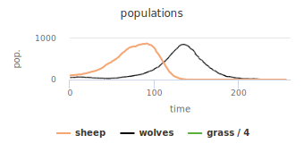
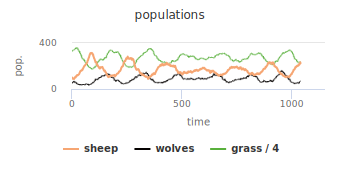

## Комп'ютерні системи імітаційного моделювання
## СПм-22-4, **Уваров Георгій Олексійович**
### Лабораторна робота №**1**. Опис імітаційних моделей та проведення обчислювальних експериментів

 

### Варіант 7 (20 mod 13), модель у середовищі NetLogo:
7. [Wolf Sheep Predation](http://www.netlogoweb.org/launch#http://www.netlogoweb.org/assets/modelslib/Sample%20Models/Biology/Wolf%20Sheep%20Predation.nlogo).

 

### Вербальний опис моделі:
Модель взаємоіснування хижаків та їх жертв. Є агенти-вівці, є агенти-вовки. Вони отримують енергію з їжею і розмножуються як прості мікроби - діляться, енергія розділяється між двома. Якщо енергія впаде до 0, помирають.
Симуляція закінчується, якщо не осталося вовків та овець, чи якщо не осталося вовків а овець стало забагато (10000).
Є можливість обрати версію "sheep-wolves-grass", де у овець буде обмежена кормова база з трави.

Sheep - вівці:
- розмножуються випадковим чином із рейтом sheep-reproduce.
sheep-wolves-grass версія:
- втрачають 1 енергії кожен крок.
- їдять траву: зелена клітина "з травою" стає коричневою "без трави".
- за 1 клітину трави поповнюють sheep-gain-from-food одиниць енергії.

Wolves - Вовки:
- розмножуються випадковим чином із рейтом wolf-reproduce.
- втрачають 1 енергії кожен крок.
- їдять 1 вівцю зі своєї клітини за такт.
- з'ївши вівцю відновлють wolf-gain-from-food одиниць енергії.

### Керуючі параметри:
- **initial-number-sheep** - скільки спочатку буде овець.
- **initial-number-wolves** - скільки спочатку буде вовків.
- **grass-regrowth-time** - рейт відновлення трави.
- **sheep-gain-from-food** - скільки енергії отримає вівця з клітини трави.
- **wolf-gain-from-food** - скільки енергії отримає вовк за вівцю.
- **sheep-reproduce** - шанс вівця народити іншу кожен такт.
- **wolf-reproduce** - шанс вовка народити іншого кожен такт.

### Внутрішні параметри:
- **energy** - скільки у вовка/вівці залишається енергії.

### Показники роботи системи:
- sheep - кількість овець.
- wolves - кількість вовків.
- grass - об'єм трави (кількість зелених клітин).

### Примітки:
При налаштуваннях керуючих параметрів за замовчуванням, випадково трапляється один із сценаріїв: вовки з'їдають всіх овець і вимирають, або популяція вовків зменшується і вівці ростуть у геометричній прогресії без серьозних перешкод аж допоки симуляція не зависає від кількості агентів.

Графік показує як зростання чисельності овець передує зростанню чисельності вовків, які винищують всіх овець і вимирають.

### Недоліки моделі:
Тварини не шукають партнерів для розмноження, а розмножуються поділом, подібно до клітин. Можна вважати, що одна тварина на екрані - це ціла зграя або стадо.

 

## Обчислювальні експерименти
*// тут наведено опис лише одного експерименту, задля скорочення прикладу. Пам'ятайте, що при реальному виконанні л/р потрібно описати щонайменше 3 експерименту.* 
### 1. Вплив початкової кількості вовків на зріст кількості овець
Досліджується залежність кількості овець на 50му, 100му, 150му та 200му кроках від начальної кількості вовків.
Інші параметри за замовчуванням:
- початкова кількість овець: 100.
- поживна вартість вівці: 20.
- рейт розмноження овець: 4%, вовків: 5%.

<table>
<thead>
<tr><th>Кількість вовків</th><th>Овець на 50</th><th>Овець на 100</th><th>Овець на 150</th><th>Овець на 200</th></tr>
</thead>
<tbody>
  <tr><td>10</td><td>581</td><td>1 889</td><td>0</td><td>0</td></tr>
  <tr><td>20</td><td>472</td><td>570</td><td>0</td><td>0</td></tr>
  <tr><td>30</td><td>477</td><td>711</td><td>0</td><td>0</td></tr>
  <tr><td>40</td><td>454</td><td>755</td><td>0</td><td>0</td></tr>
  <tr><td>50</td><td>337</td><td>355</td><td>0</td><td>0</td></tr>
  <tr><td>**50**</td><td>343</td><td>380</td><td>**3**</td><td>**4**</td></tr>
  <tr><td>50</td><td>284</td><td>260</td><td>14</td><td>47</td></tr>
  <tr><td>**60**</td><td>284</td><td>406</td><td>**6**</td><td>**11**</td></tr>
  <tr><td>**60**</td><td>346</td><td>282</td><td>**3**</td><td>**9**</td></tr>
  <tr><td>**60**</td><td>335</td><td>364</td><td>**2**</td><td>**2**</td></tr>
  <tr><td>**100**</td><td>149</td><td>408</td><td>111</td><td>**3**</td></tr>
</tbody>
</table>

Експерименти показують, що, певно, починаючи із 50% чи більше вовків, в овець з'являється практичний шанс (який?) пережити вовків і відновити потім свою популяцію. Через випадковість переміщень тварин, одна вівця цілком може уникати сотні вовків.

В одному з дослідів (50 початкових вовків) делілька овець пережили перший пік популяції вовків (380) і почали відновлювати популяцію раніше чим вимерли всі вовки, що призвело до повторного зростання популяціі вовків (1 776) і остаточному винищенню овець.

### 2. Вплив початкової кількості вовків на шанс овець пережити вовків
Досліджується залежність виживання популяції овець від начальної кількості вовків (25%, 50%, 75%).
Інші параметри за замовчуванням:
- початкова кількість овець: 100.
- поживна вартість вівці: 20.
- рейт розмноження овець: 4%, вовків: 5%.
Обмеження часу: 500 тактів. Обмеження кількості овець: 2 000.

<table>
<thead>
<tr><th>Дослід №</th><th>25 вовків</th><th>50 вовків</th><th>75 вовків</th></tr>
</thead>
<tbody>
  <tr><td>1</td><td>Винищення</td><td>Виживання</td><td>Винищення</td></tr>
  <tr><td>2</td><td>Винищення</td><td>Винищення</td><td>Виживання</td></tr>
  <tr><td>3</td><td>Винищення</td><td>Виживання</td><td>Виживання</td></tr>
  <tr><td>4</td><td>Винищення</td><td>Винищення</td><td>Виживання</td></tr>
  <tr><td>5</td><td>Виживання</td><td>Винищення</td><td>Вин. (2 пік)</td></tr>
  <tr><td>6</td><td>Винищення</td><td>Виживання</td><td>Вин. (2 пік)</td></tr>
  <tr><td>7</td><td>Винищення</td><td>Виживання</td><td>Виживання</td></tr>
  <tr><td>8</td><td>Виживання</td><td>Винищення</td><td>Винищення</td></tr>
  <tr><td>9</td><td>Винищення</td><td>Виживання</td><td>Вин. (2 пік)</td></tr>
  <tr><td>10</td><td>Винищення</td><td>Виживання</td><td>4 до 12000</td></tr>
  <tr><td>*</td><td>2 / 10</td><td>6 / 10</td><td>4 / 9</td></tr>
</tbody>
</table>

Звернемо увагу, що коли достатньо овець переживе перший пік популяції вовків, їх може бути достатньо для останніх кількох вовків, щоб вижити, тоді кількість овець виросте до тисяч, а за ними і кількість вовків, які їх винищать у 2й пік популяції. В останній прогон в певний момент на 10000 овець приходився один вовк, і тільки тоді почав розмножуватися. Симуляція стала нефункціональною у цей час, але певне вона закінчилася би винищенням.

### 3. Залежність стабільності популяції від часу відновлення трави

Режим sheep-wolves-grass вводить додаткове правило - вівці мають їсти траву (зелені клітини), щоб виживати, кількість трави обмежена територією, як у реальному світі. Це накладає обмеження на кількість овець, їх популяція тепер не може зростати нескінценно но обмеженій території.

Із параметрами за замовченням, кількість овець буде коливатися навколо середнього значення, а за нею і кількість вовків. Обидві популяції інсуватимуть стабільно невизначено довгий час, підтримуючи одне одну.

Для дослідів, назвемо "стабільною" ситуацію, подібну до цього графіку - коливання популяцій навколо середнього значення протягом 1000 тактів, без тенденцій до зникнення овець або вовків.

grass-regrowth-time - час відновлення клітини з травою, у тактах. Вівця кожен такт намагається з'їсти траву зі своєї клітини і отримати sheep-gain-from-food (4) одиниці енергії. Вівця кожен день втрачає 1 енергії. Ці правила забезпечують сталість популяції овець без хижаків, тиск добору з боку голоду.

Винищенню овець передує стрімке зростання популяції вовків, що заповнюють все поле і механічно з'їдають вівцю на будь-якій клітині, де б вона не опинилася. Цьому передує зростання чисельності овець до щільності близько 1 вівця на 2-4 клітини.

*Гіпотеза*: стабільні популяції можливі за умови, коли тиск голоду лімітує кількість овець зі щільністтю менше 4 овець на клітину, без врахування тиску хижаків. Розмір поля 50 * 50 = 2500 клітин усього, макс. кількість овець для підтримки стабільності: 2500 / 4 = 625.

*Примітка: Вихідний показник grass показує кількість клітин трави ділену на 4.*

<table>
<thead>
<tr><th>Час відновл.</th><th>Макс. овець</th><th>Макс. вовків</th><th>Результат</th><th>Макс. овець (без вовків)</th></tr>
</thead>
<tbody>
  <tr><td>10</td><td>528</td><td>463</td><td>Зник. вовків</td><td>1043</td></tr>
  <tr><td>15</td><td>629</td><td>325</td><td>Зник. вовків</td><td>692</td></tr>
  <tr><td>20</td><td>499</td><td>219</td><td>Стабільн.</td><td>(466)</td></tr>
  <tr><td>25</td><td>263</td><td>151</td><td>Стабільн.</td><td>(367)</td></tr>
  <tr><td>30</td><td>301</td><td>116</td><td>Стабільн.</td><td>(289)</td></tr>
  <tr><td>35</td><td>262</td><td>67</td><td>Стабільн.</td><td>(253)</td></tr>
  <tr><td>40</td><td>198</td><td>74</td><td>Стабільн.</td><td>(222)</td></tr>
  <tr><td>45</td><td>205</td><td>60</td><td>Стабільн.</td><td>(210)</td></tr>
  <tr><td>50</td><td>178</td><td>59</td><td>Зник. вовків</td><td>220</td></tr>
</tbody>
</table>

*Для експериментів зі стабільними популяціями максимум овець за умови відсутності вовків було отримано в інший прогон, де начальна кількість вовків була визначена у 0.*

Проведемо більше дослідів у інтервалі 15-20.

<table>
<thead>
<tr><th>Час відновл.</th><th>Макс. овець</th><th>Макс. вовків</th><th>Результат</th><th>Макс. овець (без вовків)</th></tr>
</thead>
<tbody>
  <tr><td>15</td><td>473</td><td>308</td><td>Зник. вовків</td><td>722</td></tr>
  <tr><td>16</td><td>640</td><td>280</td><td>Стабільн.</td><td>---</td></tr>
  <tr><td>18</td><td>476</td><td>260</td><td>Стабільн.</td><td>---</td></tr>
  <tr><td>19</td><td>338</td><td>220</td><td>Стабільн.</td><td>---</td></tr>
  <tr><td>20</td><td>496</td><td>176</td><td>Стабільн.</td><td>---</td></tr>
</tbody>
</table>
